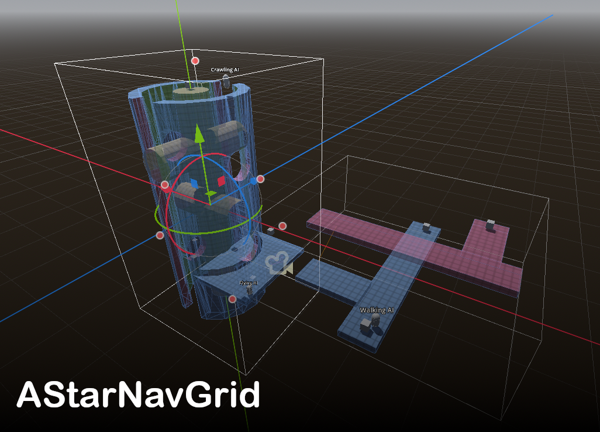

#  AStar3DNavGrid
A Godot 4.2 system for easily creating grids and path finding using AStar3D. GDExtension binaries for Windows, Linux, and MacOS(Unsigned).

## Features
These are the main features of the addon.
* Support for walking, flying, swimming, and climbing navigation. 
* Easy to define box area for baking a **[NavGrid]**.
* Saving bake data to avoid baking times.
* Custom C++ node to get_point_path with AStar3D on multiple threads.

## Components
These are the components of the addon.

* **NavGrid**: The main components for handling AStar3D generating and path finding. 
* **NavGridLink**: Connects two different locations in a NavGrid.
* **NavGridPathFinder**: C++ component for get_point_path. Can execute this function on separate threads. Must be a child of a **[NavGrid]**.
* **NavGridAgent**: Used to interface with **[NavGrid]** for subscribing to paths.
    * **subscribe_for_path(manager : NavGrid, start : Vector3, end : Vector3)**: Queues this **[NavGridAgent]** function to receive a path between 2 points from a **[NavGrid]**.
    * **on_path_received(path : PackedVector3Array)**: Signal emitted when a path subscribed for has been received.

```python
# Example of using some of the functions
func example():
	nav_agent = get_node("CollisionShape3D/NavGridAgent")
	nav_agent.on_path_received.connect(path_received)
	nav_agent.subscribe_for_path(my_nav_grid, position, target.position)
```

## Installation
You can download the whole demo project and open it with Godot or download the "/astar3dnavgrid" folder from the "/addon" folder and put it in your "/addon" folder in your project. Make sure to enable the addon in your Project Settings.
